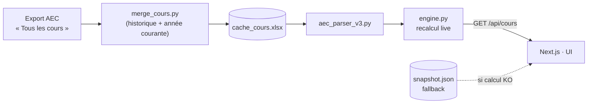

<div align="center">


# OSCAR

**Outil de Suivi des Cours et d'Analyse du Réseau**

Pilotage statistique du réseau de l'**Institut français Italia** — cours, profils, produits.

<br/>


</div>

---

## 🧭 Deux interfaces, une même donnée

| | **v3** — *recommandée* | **v2** |
|---|---|---|
| **Stack** | Next.js + FastAPI | Streamlit |
| **Hébergement** | Vercel (serverless) · 🔒 mot de passe | [Streamlit Cloud](https://ifi-stats-aec.streamlit.app) |
| **Source de données** | cache « Tous les cours » par cours, recalcul live | ZIP annuels « rapport par catégorie » |
| **Emplacement** | [`oscar-prealpha/web/`](oscar-prealpha/web/) | [`dashboard_aec_v2.py`](dashboard_aec_v2.py) |
| **Statut** | ✅ actif | ✅ actif |

> 🏷️ **Note de nommage** : dans d'anciennes docs, `dashboard_aec_v2.py` était étiqueté « v3.0 » — ce « v3 » désignait la *génération du parser AEC*, pas l'UI. Ici **v2 = Streamlit**, **v3 = Next.js**.

---

## ✨ Fonctionnalités (v3)

| Domaine | Vues |
|---|---|
| **Cours** | Synthèse · Par antenne · Secteurs · Répartition · Année vs année · Rentabilité · Évolutions · Graphiques · 🗺️ Carte 3D |
| **Profils** | Synthèse · Démographie · Nationalités · Motivation |
| **Produits** | Catalogue · Types · Tarifs |

- 📊 **Indicateurs** : inscriptions, élèves différents, cours, heures, remplissage, recettes, **panier / inscription**, **panier / personne**
- 🎛️ Filtres en cascade (année · antenne · secteur), bascule **année civile / scolaire**
- 🤖 Assistant IA (API Albert) · 📋 copie de graphique en image · 🆚 page `/compare` (v2 ⇄ v3)

---

## 🔌 Architecture des données (v3)



- **Source de vérité** : [`oscar-prealpha/web/server/data/new_cours/cache_cours.xlsx`](oscar-prealpha/web/server/data/new_cours/) (1 ligne = 1 cours), + `cache_eleves.xlsx` (élèves différents).
- Le moteur **recalcule à la demande** pour chaque filtre (`/api/cours`) ; `snapshot.json` n'est qu'un **fallback**.
- En prod, le backend FastAPI tourne en **fonction serverless** ([`web/api/index.py`](oscar-prealpha/web/api/index.py)) ; tout `/api/*` y est routé, protégé par cookie de session (middleware).

---

## 🚀 Démarrage rapide

<details>
<summary><strong>v3 — Next.js + FastAPI</strong> (local)</summary>

```bash
# 1) Backend FastAPI — http://localhost:8000
cd oscar-prealpha/web/server && ./run.sh

# 2) Frontend Next.js — http://localhost:3000
cd oscar-prealpha/web && npm install && npm run dev
```

Auth locale : créer `oscar-prealpha/web/.env.local` (voir `.env.local.example`) avec
`OSCAR_PASSWORD_SHA256` et `OSCAR_SESSION_SECRET`.
</details>

<details>
<summary><strong>v2 — Streamlit</strong> (local)</summary>

```bash
pip install -r requirements.txt
streamlit run dashboard_aec_v2.py
```
</details>

> **Déploiement** : un `git push origin main` redéploie **automatiquement** la v3 (Vercel) et la v2 (Streamlit Cloud).

---

## 🔄 Mettre à jour les données (ex. compléter le 25-26)

```bash
# 1) Fusionner le nouvel export complet avec l'historique
python merge_cours.py \
  oscar-prealpha/web/server/data/new_cours/cache_cours.xlsx \
  "aec export cours 25.26.xlsx" \
  cache_cours_merged.xlsx \
  2025-09-01                       # cutoff = rentrée de l'année rafraîchie

# 2) Remplacer le cache + régénérer le fallback
cp cache_cours_merged.xlsx oscar-prealpha/web/server/data/new_cours/cache_cours.xlsx
python oscar-prealpha/web/server/build_snapshot.py

# 3) git push → redéploiement automatique
```

> Un export AEC ne couvre que l'année courante ; `merge_cours.py` **conserve l'historique** (cours < cutoff) et **remplace** la fenêtre récente (≥ cutoff). Ne jamais écraser `cache_cours.xlsx` en entier.

---

## 🗂️ Structure du dépôt

<details>
<summary>Voir l'arborescence</summary>

```
ifi_stats_aec/
├─ dashboard_aec_v2.py          # v2 — app Streamlit (prod)
├─ merge_cours.py               # fusion export « Tous les cours » + historique
├─ merge_eleves.py              # fusion caches « élèves par classe »
├─ export_eleves_par_classe.py  # scraping AEC (Playwright)
├─ data/                        # données v2 (ZIP annuels, produits, profils)
└─ oscar-prealpha/
   ├─ shell/                    # comparateur v2/v3 standalone
   └─ web/                      # v3 — Next.js + FastAPI
      ├─ app/                   # routes (cours, profils, produits, compare, login)
      ├─ components/            # KPI, charts, filtres, carte 3D, assistant…
      ├─ lib/                   # types, client API, store, formatters
      └─ server/               # backend FastAPI
         ├─ engine.py            # recalcul live (/api/cours)
         ├─ aec_parser_v3.py     # parser « Tous les cours »
         ├─ build_snapshot.py    # fixture de secours
         ├─ data/new_cours/      # cache_cours.xlsx · cache_eleves.xlsx
         └─ fixtures/            # snapshot.json · profils.json · produits.json
```
</details>

---

## 💾 Sauvegardes

| Réf git | Contenu |
|---|---|
| `archive/desktop-oscar` | Ancienne app desktop OSCAR + `dashboard_aec_v2_legacy_backup.py` (récupérables) |
| `backup-restore-attempt-2026-05-27` | Ancienne tentative de restauration |
| tags `backup-*` | Snapshots de `main` avant les grosses passes |

```bash
git checkout archive/desktop-oscar -- <chemin/du/fichier>   # ressortir un fichier archivé
```

---

## 🔐 Confidentialité

Données analysées côté serveur (Streamlit / fonction serverless Vercel), agrégées au niveau cours — aucune donnée nominative exposée dans l'UI. La v3 est protégée par mot de passe.

<div align="center"><sub>© Institut français Italia — usage interne uniquement</sub></div>
